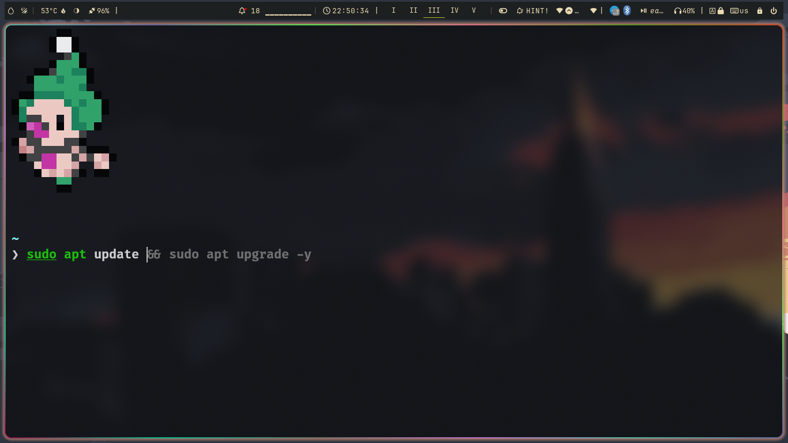

# 🛠 CustomTerminal ~ >
## What are we gonna achieve -


> [!NOTE]
> This repo is divided into three part in each part i will covering
> 1. ZSH
> 1. TMUX
> 1. ZOXIDE
> - This repo is specific for zsh but why mentioned all three of them here in this repo.
> - Because i wanna let you know there are more customization on terminal other than how it looks.

# 1. ZSH
In Explaining with simple words i will tell you what is zsh . zsh stands for z - shell it is basically used for plugins and themeing our terminal.
we will install it in ubuntu :
```
sudo apt install zsh
```
and if you are using another OS you can use their package manager to install it simply , let me put a example for, 
For Arch linux:
```
sudo pacman -S zsh
```
Now that we are done with zsh installation.

we will install **Oh-my-zsh** just run this command to install :\
Curl
```
sh -c "$(curl -fsSL https://raw.githubusercontent.com/ohmyzsh/ohmyzsh/master/tools/install.sh)"
```
Wget
```
sh -c "$(wget https://raw.githubusercontent.com/ohmyzsh/ohmyzsh/master/tools/install.sh -O -)"
```

### Now that we have installed every thing we will understand the code we are going to edit 

```.zshrc
# Oh My Zsh configuration
export ZSH="$HOME/.oh-my-zsh"
ZSH_THEME="robbyrussell"
```
1. On the first line we are ensuring that zsh configured each time when we use the terminal
1. On the second line we are selecting the theme of our terminal

```.zshrc
# Plugins
plugins=(
    git
    zsh-autosuggestions
    zsh-syntax-highlighting
)
```
- we integrating our terminal with some plugins inside our plugins table
  - git - it allows us to perform git operations like clone and etc.
  - zsh-autosuggestions - this extension is used for suggestions which will be shown in next image i will put .
  - zsh-syntax-highlighting - which will highlight words which probably is in our source code it allows us to highlight ssome terms it will be also shown in next image



As we can see that sytax highlighting is working properly and sugeestions is working properly cause suggestion are grey they are yet not typed

```.zshrc
# Load Oh My Zsh
source "$ZSH/oh-my-zsh.sh"
```
This line of code with load oh my zsh\
and yes there is way we can load our zshrc file we need to perform a single command in terminal\
```
source .zshrc
```

