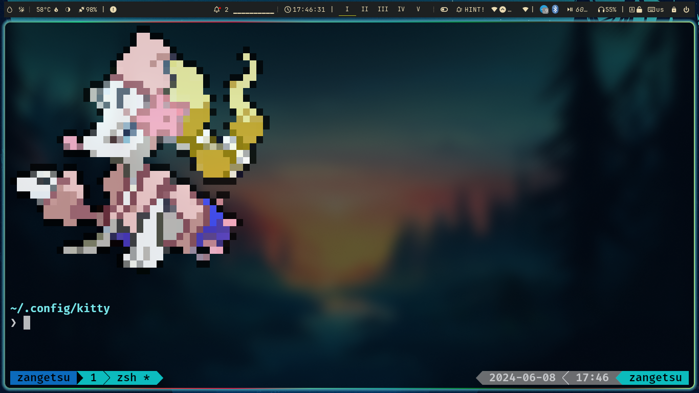

# 🛠 CustomTerminal ~ >
## What are we gonna achieve -


> [!NOTE]
> This repo is divided into three part in each part i will covering
> 1. ZSH
> 1. TMUX
> 1. ZOXIDE
> - This repo is specific for zsh but why mentioned all three of them here in this repo.
> - Because i wanna let you know there are more customization on terminal other than how it looks.

# 1. ZSH
In Explaining with simple words i will tell you what is zsh . zsh stands for z - shell it is basically used for plugins and themeing our terminal.
we will install it in ubuntu :
```
sudo apt install zsh
```
and if you are using another OS you can use their package manager to install it simply , let me put a example for, 
For Arch linux:
```
sudo pacman -S zsh
```
Now that we are done with zsh installation.

we will install **Oh-my-zsh** just run this command to install :\
Curl
```
sh -c "$(curl -fsSL https://raw.githubusercontent.com/ohmyzsh/ohmyzsh/master/tools/install.sh)"
```
Wget
```
sh -c "$(wget https://raw.githubusercontent.com/ohmyzsh/ohmyzsh/master/tools/install.sh -O -)"
```


